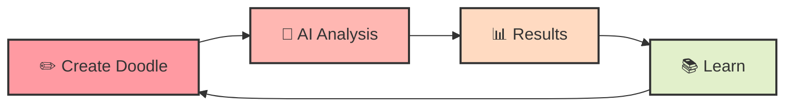

# 🕵️‍♀️ Doodle Detector 🖌️ ✨

<div align="center">


## 🌟 _Where AI Meets Artistry_ 🌟

[](LICENSE)
[](https://github.com/AksharaaSharma)

</div>

## 🎬 See the Magic in Action!

<div align="center">
  
[](https://www.youtube.com/watch?v=DO3PW_hGQQk "Watch the Doodle Detector in action!")

> 👆 **Click to watch our magical prototype in action!** 👆

</div>

## 🌟 About

Doodle Detector is your friendly neighborhood AI art critic! 🎭 This magical tool uses the power of neural networks to analyze your hand-drawn masterpieces and determine if they contain potentially offensive content. Think of it as having a tiny art detective inside your computer, carefully examining every stroke of your digital brush! 🔍👨‍🎨

<div align="center">
  
```
"Every line you draw tells a story. We're just helping make sure it's appropriate for all chapters of life."
```

</div>

## ✨ Features

<table>
  <tr>
    <td width="50%">
      <h3>🎨 Magical Drawing Canvas</h3>
      Express yourself freely with our enchanted drawing tools!
    </td>
    <td width="50%">
      <h3>📤 Doodle Uploading</h3>
      Already created your masterpiece elsewhere? No problem!
    </td>
  </tr>
  <tr>
    <td width="50%">
      <h3>🧠 Dual AI Brainpower</h3>
      <ul>
        <li>🔄 CLIP model for lightning-fast first impressions</li>
        <li>🤖 Gemini 1.5 for deep artistic analysis</li>
      </ul>
    </td>
    <td width="50%">
      <h3>📊 Detailed Feedback</h3>
      Get confidence scores and specific insights about your creation
    </td>
  </tr>
  <tr>
    <td colspan="2" align="center">
      <h3>🌈 Beautiful Interface</h3>
      Our UI sparkles with delightful animations and intuitive design
    </td>
  </tr>
</table>

## 🎭 The Journey of Your Doodle



## 🚀 Technology Wizardry

<div align="center">
  <table>
    <tr>
      <td align="center"><br>💻 Streamlit</td>
      <td align="center"><br>🔥 PyTorch</td>
      <td align="center"><br>🤖 Transformers</td>
      <td align="center"><br>🧙‍♂️ Google AI</td>
    </tr>
  </table>
</div>

## 🛠️ Conjuring Instructions

<div align="center">
  


</div>

```bash
# Summon the repository
git clone https://github.com/yourusername/doodle-detector.git
cd doodle-detector

# Create your magical environment
python -m venv venv
source venv/bin/activate  # On Windows: venv\Scripts\activate

# Gather the required magical components
pip install -r requirements.txt

# Release the magic!
streamlit run app.py
```

## 💡 The Magical Process

<div align="center">
  <table>
    <tr>
      <td width="25%" align="center">
        <h3>✍️ CREATE</h3>
        
        <p>Draw your masterpiece or upload an existing doodle</p>
      </td>
      <td width="25%" align="center">
        <h3>⚡ ANALYZE</h3>
        
        <p>Your art zooms through our neural networks</p>
      </td>
      <td width="25%" align="center">
        <h3>🧐 DISCOVER</h3>
        
        <p>Receive detailed insights about your creation</p>
      </td>
      <td width="25%" align="center">
        <h3>📚 LEARN</h3>
        
        <p>Understand content guidelines through explanations</p>
      </td>
    </tr>
  </table>
</div>

## 🔒 Enchanted Privacy Shield

<div align="center">
  
```
We protect your creative expressions with the strongest magical barriers!
```

</div>

- 🔄 **Real-time processing** of all doodles
- 🔥 **No permanent storage** of your creative expressions
- 📜 **Transparent explanations** for all classifications
- 🎓 **Educational insights** to help understand content guidelines

## 👩‍💻 Join Our Coven of Contributors

<div align="center">
  


</div>

The magical community welcomes new spell-casters! 🧙‍♀️

1. 🍴 **Fork** the magical repository
2. 🌿 **Create** your feature branch (`git checkout -b feature/amazing-spell`)
3. 💫 **Cast** your changes (`git commit -m 'Add some amazing magical feature'`)
4. 🚀 **Launch** your contributions (`git push origin feature/amazing-spell`)
5. 🙏 **Request** your spell to be added to the grimoire (Open a Pull Request)

## 📄 Scroll of License

This magical artifact is protected by the MIT License - see the [LICENSE](LICENSE) scroll for details.

## 🙏 Gratitude to Fellow Wizards

<div align="center">
  <table>
    <tr>
      <td align="center"><br>🧠 OpenAI</td>
      <td align="center"><br>🌐 Google</td>
      <td align="center"><br>💫 Streamlit</td>
      <td align="center"><br>🌟 Contributors</td>
    </tr>
  </table>
</div>

---

<div align="center">
  


## 💭 Words of Wisdom

*"Every doodle tells a story. We're just here to make sure it's a tale worth telling."*  
                                                       - The Doodle Detective 🕵️‍♀️

<p align="center">✨ Crafted with magical love for responsible AI development ✨</p>

</div>
