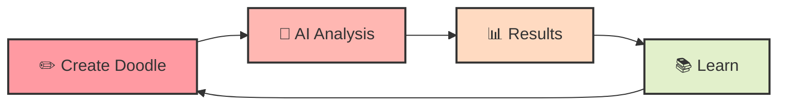

# 🕵️‍♀️ Doodle Detector 🎨 ✨

<div align="center">


## 🌟 _Where AI Meets Artistry_ 🌟

[](https://opensource.org/licenses/MIT)
[](https://www.python.org/)
[](https://streamlit.io/)
[](https://pytorch.org/)
[](https://github.com/yourusername/doodle-detector)

</div>

## 🎮 See the Magic in Action!

<div align="center">
  
<a href="https://www.youtube.com/watch?v=DO3PW_hGQQk" target="_blank">
  
</a>

> 👆 **Click to watch our magical prototype in action!** 👆

</div>

## 🌟 About

Doodle Detector is your friendly neighborhood AI art critic! 🎭 This magical tool uses the power of neural networks to analyze your hand-drawn masterpieces and determine if they contain potentially offensive content. Think of it as having a tiny art detective inside your computer, carefully examining every stroke of your digital brush! 🔍👨‍🎨

<div align="center">
  
```
"Every line you draw tells a story. We're just helping make sure it's appropriate for all chapters of life."
```

</div>

## ✨ Features

<div align="center">
<table>
  <tr>
    <td align="center" width="50%">
      <h3>🎨 Magical Drawing Canvas</h3>
      <p>Express yourself freely with our enchanted drawing tools!</p>
      
    </td>
    <td align="center" width="50%">
      <h3>📄 Doodle Uploading</h3>
      <p>Already created your masterpiece elsewhere? No problem!</p>
      
    </td>
  </tr>
  <tr>
    <td align="center" width="50%">
      <h3>🧠 Dual AI Brainpower</h3>
      <ul align="left">
        <li>🔄 CLIP model for lightning-fast first impressions</li>
        <li>🤖 Gemini 1.5 for deep artistic analysis</li>
      </ul>
      
    </td>
    <td align="center" width="50%">
      <h3>📊 Detailed Feedback</h3>
      <p>Get confidence scores and specific insights about your creation</p>
      
    </td>
  </tr>
</table>
</div>

## 🎭 The Journey of Your Doodle



## 🚀 Technology Wizardry

<div align="center">
  <table>
    <tr>
      <td align="center"><a href="https://streamlit.io/"><br>💻 Streamlit</a></td>
      <td align="center"><a href="https://pytorch.org/"><br>🔥 PyTorch</a></td>
      <td align="center"><a href="https://huggingface.co/transformers/"><br>🤖 Transformers</a></td>
      <td align="center"><a href="https://ai.google/"><br>🧙‍ Google AI</a></td>
    </tr>
  </table>
</div>

## 🌈 Beautiful & Intuitive UI

<div align="center">
  
</div>

## 🛠️ Installation Guide

```bash
# Clone the repository
git clone https://github.com/yourusername/doodle-detector.git
cd doodle-detector

# Create and activate virtual environment
python -m venv venv
source venv/bin/activate  # On Windows: venv\Scripts\activate

# Install dependencies
pip install -r requirements.txt

# Run the application
streamlit run app.py
```

## 🔒 Privacy Shield

<div align="center">
  <table>
    <tr>
      <td align="center">🔄<br><b>Real-time processing</b><br>of all doodles</td>
      <td align="center">🔥<br><b>No permanent storage</b><br>of your creative expressions</td>
    </tr>
    <tr>
      <td align="center">📚<br><b>Transparent explanations</b><br>for all classifications</td>
      <td align="center">🎓<br><b>Educational insights</b><br>to help understand content guidelines</td>
    </tr>
  </table>
</div>

## 👩‍💻 Join Our Community

We welcome contributors with magical ideas! Here's how to join our spellcasting:

<div align="center">
  <table>
    <tr>
      <td align="center">🌱<br><b>Fork</b><br>the repository</td>
      <td align="center">🌿<br><b>Create</b><br>your feature branch</td>
      <td align="center">🌟<br><b>Commit</b><br>your changes</td>
      <td align="center">🚀<br><b>Push</b><br>your contributions</td>
      <td align="center">🙏<br><b>Open</b><br>a Pull Request</td>
    </tr>
  </table>
</div>

## 📝 License

This project is licensed under the MIT License - see the [LICENSE](LICENSE) file for details.

## 💖 Acknowledgments

<div align="center">
  <table>
    <tr>
      <td align="center"><a href="https://openai.com/"><br>🧠 OpenAI</a></td>
      <td align="center"><a href="https://www.google.com/"><br>🌐 Google</a></td>
      <td align="center"><a href="https://streamlit.io/"><br>💖 Streamlit</a></td>
      <td align="center"><a href="https://github.com/yourusername/doodle-detector/graphs/contributors"><br>🌟 Contributors</a></td>
    </tr>
  </table>
</div>

<p align="center">
  <a href="https://github.com/yourusername/doodle-detector/stargazers">⭐ Star us on GitHub</a> •
  <a href="https://twitter.com/yourusername">🐦 Follow us on Twitter</a> •
  <a href="https://discord.gg/yourdiscord">💬 Join our Discord</a>
</p>
